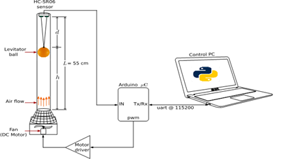
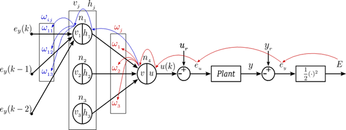

# Neural Network Control Insights and Strategies in Low-Cost Educational Platforms

This repository contains the development, implementation, and analysis of neural network-based control strategies applied to low-cost educational platforms.

> ⚠️ **Note:** The neural network controller included in this project was implemented **natively**, without the use of machine learning libraries such as TensorFlow or PyTorch. All computations were carried out using **basic numerical operations** and standard Python libraries, ensuring full transparency and adaptability of the control logic.
## Objective

To explore and implement intelligent control techniques (specifically neural network control) for affordable physical systems, aiming to strengthen hands-on learning in automation and control engineering.

## Repository Structure

### Codes/
├── Neural_Network_Controller.py # Main neural network controller
├── PID_Controller.py # Comparison with classical PID control
├── levitator_communication_Python/ # Communication code for the physical system

### Data/
├── *.xlsx # Experimental datasets and results

### Drawings/
├── *.png / *.pdf # Drawings (mm), System diagram and schematics 

## Technologies Used

- Python 3.11+
- matplotlib, numpy, pandas
- Arduino (for the physical plant)

## Experimental Validation

The system has been tested on a didactic pneumatic levitation plant, enabling a performance comparison between classical controllers and the adaptive neural network approach.

## How to Run

1. Clone the repository:

git clone https://github.com/juantello1/Neural_Network_Control.git
cd Neural_Network_Control
Install dependencies:

pip install -r requirements.txt

Run the controller:

python Codes/Neural_Network_Controller.py

Ensure the plant is connected and the serial communication is correctly configured.

Author

Juan Tello

Control Engineer
📫 juan_tello91142_@elpoli.edu.co-
    juanmanueltellom@gmail.com

 License

This project is licensed under the MIT License. Feel free to use it for academic and research purposes. 

